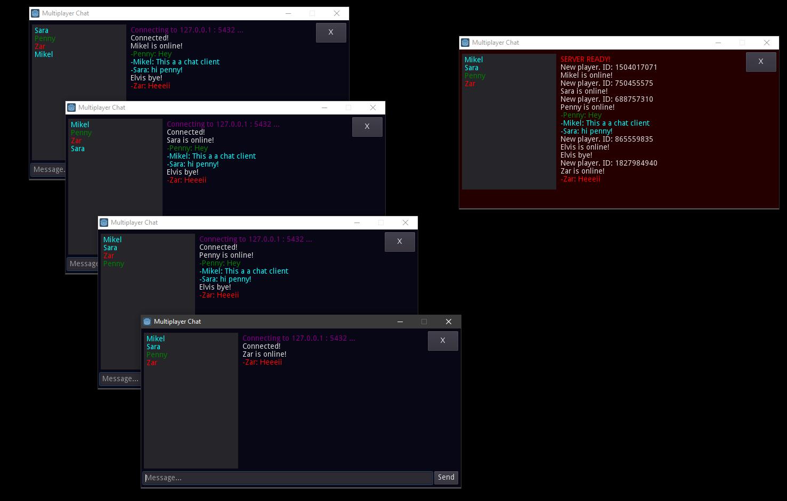

# Godot3 Simple Chat
This is a simple example how to use c# and godot networking system. The server is dedicate. 

Godot proyect is a 1 scene and 1 c# script. This is an easy and simple example to start practicing networking.
I also use RichTextLabel: colors, and meta click signal to show player data model.

Have fun.

